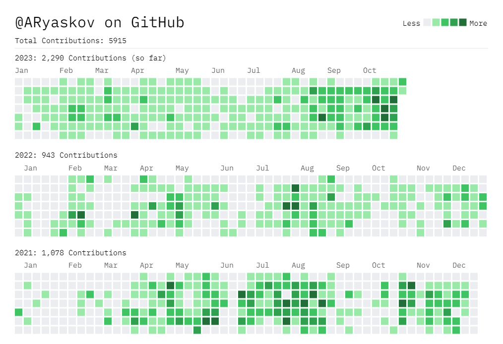

### Hi there 👋

My name is Andrei (Eddie).

I'm a
 - Tech Adviser
 - Blockchain Enthusiast
 - Co-founder of Maroo.us (Former HoE of) ( / YC21S)

I'm proficient in

I like

### My NPM-packages

[@riaskov/vk-signin-widget](https://www.npmjs.com/package/@riaskov/vk-signin-widget) - VK ID Sign-In Widget for React

---

[@riaskov/mmap-io](https://www.npmjs.com/package/@riaskov/mmap-io) - Memory-mapped file I/O for Node.js

---

[@riaskov/metro-ru](https://www.npmjs.com/package/@riaskov/metro-ru) - Russian Cities metro (subway) stations data with methods for calculating a distance between given coordinate and station (using Haversine formula).

---

[@riaskov/xpub2address](https://www.npmjs.com/package/@riaskov/xpub2address) - Convert xpub to BTC address using derivation path. BIP49 (P2SH (Pay 2 Script Hash), 3-addresses) and BIP84 (bech32) are supported.

---

[@riaskov/iohtee-abi-wrapper](https://www.npmjs.com/package/@riaskov/iohtee-abi-wrapper) - IohTee ABI Wrapper is a TypeScript wrapper for EVM-compatible ABI of Solidity smartcontract. It takes raw json artifact file and render ready-to-use TS-wrapper. Use viem v2 internally.

---

[@riaskov/iohtee-contracts](https://www.npmjs.com/package/@riaskov/iohtee-contracts) - IohTee contracts is a TypeScript interface for Ethereum contracts managed by Hardhat used by IohTee.

---

[@riaskov/iohtee](https://www.npmjs.com/package/@riaskov/iohtee) - IohTee is a Node.js library for micropayments in Ether over HTTP. It allows you to send and receive a minuscule amount of money instantly.

---

[@riaskov/nestjs-graph-visualizer](https://www.npmjs.com/package/@riaskov/nestjs-graph-visualizer) - Generate a visualization of your NestJS app's dependency graph! 💥

---

[@riaskov/nestjs-trace](https://www.npmjs.com/package/@riaskov/nestjs-trace) - Lightweight NestJS tracing (debug print) plugin for controllers and services, supporting Express & Fastify, CJS & ESM.

### My Rust Crates

[get_dir_hash](https://crates.io/crates/get_dir_hash) - Deterministic **directory hashing** with glob ignores and optional metadata — powered by **BLAKE3**. Tiny, fast, and predictable. Great for cache keys, change detection, CI, and reproducible builds.

---

[kira_kv_engine](https://crates.io/crates/kira_kv_engine) - KV-storage engine based on Minimal perfect hash functions with hybrid indexing (+PGM Index) for Rust. Zero collisions. Pure O(1) performance.

---

[pgm_index](https://crates.io/crates/pgm_index) - PGM-Index is a space-efficient data structure for fast lookup in sorted sequences. It approximates the distribution of keys with piecewise linear models, allowing searches in O(log ε) with a guaranteed error bound.

---

[minimal_perfect_hash](https://crates.io/crates/minimal_perfect_hash) - A blazing-fast BDZ minimal perfect hash function implementation in Rust. Designed for production-scale workloads with millions of keys, minimal memory footprint, and predictable O(1) lookups.

### My Deno JSR packages

[deno-mmap](https://jsr.io/@riaskov/mmap) - High-performance memory-mapped file I/O for Deno/Typescript via FFI (Rust backend). Zero-overhead mapping, bulk read/write in a single native call, cross-platform binaries auto-downloaded from GitHub Releases with SHA-256 verification. Works on Windows x86_64, Linux x86_64, macOS aarch64 (Apple Silicon). Requires Deno 2.x with FFI permissions.

<!--
**ARyaskov/ARyaskov** is a ✨ _special_ ✨ repository because its `README.md` (this file) appears on your GitHub profile.

Here are some ideas to get you started:

- 🔭 I’m currently working on ...
- 🌱 I’m currently learning ...
- 👯 I’m looking to collaborate on ...
- 🤔 I’m looking for help with ...
- 💬 Ask me about ...
- 📫 How to reach me: ...
- 😄 Pronouns: ...
- ⚡ Fun fact: ...
-->
